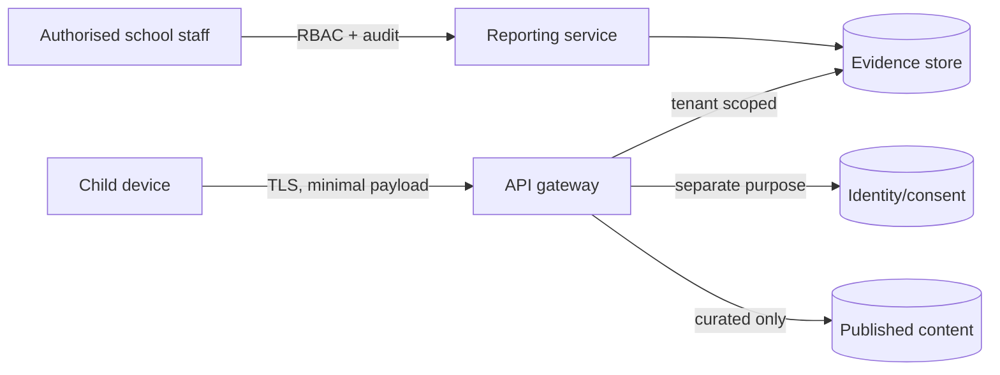

# Data, privacy and safeguarding architecture

## Data classes

| Class | Examples | Default retention |
|---|---|---|
| Local guest state | mission save, settings, objective evidence | device only; child/adult can clear |
| School identity | tenant ID, pseudonymous learner ID, class membership | contract-defined; delete/export workflows |
| Learning evidence | objective, item version, outcome, support, coarse time band | shortest period justified by education purpose |
| Operational telemetry | crash code, asset/version, coarse capability tier | short rolling window |
| Safeguarding report | reporter, category, controlled context | restricted case process; policy-defined |

Never collect advertising identifiers, precise location, contact discovery, public profile photo, biometric templates or raw typed free text for analytics.

## Trust boundaries

## Production gates

- Children’s Code/UK GDPR DPIA and lawful-basis review.
- Safeguarding lead approval and incident/report response procedure.
- Threat model covering school tenancy, IDOR, content supply chain, stored XSS and abuse of collaboration.
- Independent penetration test and dependency scanning.
- Content moderation/publishing separation of duties.
- Deletion, subject access, school offboarding and breach-response rehearsals.
- Age-appropriate privacy notice tested with children.

## Secure defaults

Content Security Policy with self-hosted assets, secure cookies for authenticated flows, CSRF protection, strict tenant checks, encryption in transit/at rest, audited privileged access, short-lived sessions, rate limits and safe log scrubbing. Do not rely on a child to configure protection correctly.

