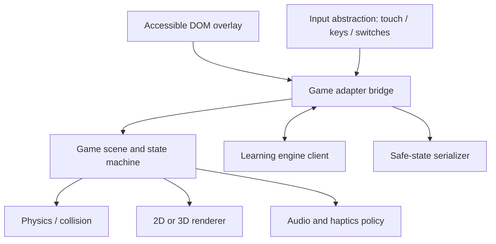

# Game engine and runtime architecture

## Recommended stack

Use a progressive web app shell with DOM-based learning UI. Games are lazy-loaded packages behind an adapter.

- Babylon.js candidate for 3D Blocksmith and Skybound because it provides a full scene/runtime stack, WebGL/WebGPU routes, input and inspection tooling.
- Phaser candidate for 2D Chronicle because of mature scene, input, camera and asset systems.
- TypeScript for production shared contracts.
- Web Audio with explicit independent controls; service worker for downloaded missions.

The playable Blocksmith, Skybound, LexiClimb and Maths Outbreak prototypes use Three.js from a pinned import map while keeping game rules in renderer-independent modules. Chronicle remains available as an earlier lightweight DOM/canvas prototype. All routes remain static-host compatible on GitHub Pages and Netlify.

## Runtime layers

## Shared game state machine

`BOOT → INTRO → PLAY → CHALLENGE → FEEDBACK → PLAY → RECAP → COMPLETE`, with `PAUSED` reachable from every interactive state. Learning prompts should appear at meaningful decision points, never interrupt a jump already in progress.

## Performance tiers

- Tier A: 3D, dynamic lighting capped, particles and richer audio.
- Tier B: 3D simplified materials, static lighting, reduced draw distance.
- Tier C: equivalent 2.5D/2D interaction with the same challenge contract.

Detect broad capability from frame timing, not device fingerprinting. Offer a manual “simpler graphics” control.

Blocksmith's current prototype maps capable desktops to its richer tier and maps coarse-pointer devices, ChromeOS, four-core-or-lower devices and devices reporting 4 GB memory or less to its low-power tier. The runtime uses procedural, seeded content in both tiers; quality changes only rendering cost. Terrain is divided into cullable instance chunks, repeated voxel props share instance batches, shadows and pixel density are bounded, distant actors stop animating, and non-render UI work is throttled. The low tier renders every animation frame rather than imposing an uneven fractional frame cap, while player physics uses fixed 60 Hz substeps and catches up safely after a slow frame. Query-string tier overrides make browser profiling and screenshot regression deterministic. A production build should add sustained frame-time sampling and expose a child-friendly graphics switch without changing saved world data.

Skybound reuses the same capability selector and fixed 60 Hz simulation. Checkpoints, posts and clouds are instanced; only the twenty stateful glass tiles and the small block-character rig remain individual meshes. `skybound-questions.js` adapts the shared 900-question registry into ten deterministic two-option physical choices for a selected Year 3–5 and English/Maths/Science scope. Ten sets partition all 100 records in that scope without source repetition. Long options use wrapped world-space signs plus an accessible HUD legend. The renderer-independent bridge state machine remains the authority for answer lanes, falls, retries, checkpoint progression and completion.

LexiClimb reuses Skybound's camera-relative movement, analogue input, buffered jump, procedural audio and low-power selection. Each themed world has five curriculum circuits, five path-to-wall sections per circuit, 26 checkpoint platforms, five physical level flags and 25 collapsible learning walls on one continuous helix. `wordwall-course.js` deterministically rotates rainbow stairs, prism tunnels, uphill runways, donut rings and floating ribbons through every level. Its renderer-independent 0.5-unit route grid gives each support an explicit cell footprint, rejects negative/overlapping intervals after final mesh sizing, keeps continuous slabs edge-to-edge and reserves measured gaps only for jumping routes. Circular checkpoints remove rotation-dependent corner intrusion. Nine year-and-subject modules materialise 900 reviewed questions; `curriculum-year-banks.js` enforces 100 per year and subject, `curriculum-learning-guides.js` creates live-question teaching support, and the seeded generator selects five matching-difficulty records per circuit without replacement. Four 25-wall sets exhaust a selected 100-question scope before wrapping. `wordwall-engine.js` owns the spiral pose formula, ring/shape footprints, solid side/underside collision, gate collision, checkpoint-relative fall recovery, one-question-per-wall progression, answer normalisation and validated coin/skin profile. Three.js consumes those dimensions and batches the repeated paths, checkpoint rings, tunnel frames and all 30 collectible coins; only stateful walls, flags and the avatar remain individual objects.

Maths Outbreak adds a first-person adapter without tying its learning or swarm rules to Three.js. `outbreak-questions.js` deterministically creates five curriculum-scaled rounds for Years 3–5, each with question-specific Learn steps, a hidden target from 3–15 and spare swarm members. `outbreak-engine.js` owns exact-count confirmation, neutral incorrect retries, checkpoint order, damage, respawn, hiding and pooled swarm movement. `outbreak-map.js` owns the 32 × 32 tile plan, collision, low-clearance routes, cover, line of sight and checkpoint path validation. Its deterministic `outbreak-environment-plan.js` adds visual zoning and landmarks without changing collision; `outbreak-environment.js` consumes that plan as a shared-material, instanced Three.js layer. `game-input.js` supplies the reusable analogue stick and hold action used by touch controls. The renderer batches 1,024 floor tiles, buildings, windows, street furniture, planting, walls, cover and each block-zombie body part with instancing; coarse-pointer, ChromeOS and low-memory devices disable shadows, antialiasing, high pixel density and half of the distant planting. Only accessible DOM HUD, Learn, pause and result overlays sit outside the scene.

## Content packaging

Each game bundle contains manifest, engine adapter, scenes, localised strings, asset catalogue with licences, tutorial, accessibility declaration and integrity hash. Learning content remains separate so the same game can run England Year 3 or Wales Progression Step 2–3 packs.

## Test pyramid

- Unit: state machines, scoring boundaries, contracts, deterministic challenge selection.
- Contract: every game adapter passes the shared challenge/evidence suite.
- Browser: keyboard/touch paths, pause/resume, offline and orientation changes.
- Visual: 320×800, 390×844, 768×1024, 1280×720 and extreme 844×390.
- Device: representative low-end Android, iPad class tablet, Chromebook and keyboard-only desktop.
- Learning: educator content review plus child usability and transfer studies.
