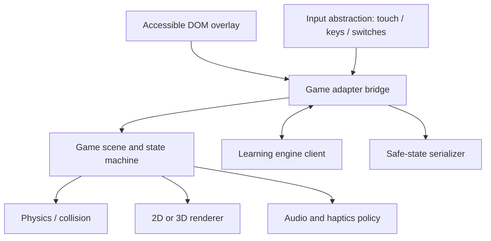

# Game engine and runtime architecture

## Recommended stack

Use a progressive web app shell with DOM-based learning UI. Games are lazy-loaded packages behind an adapter.

- Babylon.js candidate for 3D Blocksmith and Skybound because it provides a full scene/runtime stack, WebGL/WebGPU routes, input and inspection tooling.
- Phaser candidate for 2D Chronicle because of mature scene, input, camera and asset systems.
- TypeScript for production shared contracts.
- Web Audio with explicit independent controls; service worker for downloaded missions.

The HTML prototypes use no third-party engine so they load directly on GitHub Pages and keep the architecture inspectable. They validate interaction/layout, not production physics.

## Runtime layers

## Shared game state machine

`BOOT → INTRO → PLAY → CHALLENGE → FEEDBACK → PLAY → RECAP → COMPLETE`, with `PAUSED` reachable from every interactive state. Learning prompts should appear at meaningful decision points, never interrupt a jump already in progress.

## Performance tiers

- Tier A: 3D, dynamic lighting capped, particles and richer audio.
- Tier B: 3D simplified materials, static lighting, reduced draw distance.
- Tier C: equivalent 2.5D/2D interaction with the same challenge contract.

Detect broad capability from frame timing, not device fingerprinting. Offer a manual “simpler graphics” control.

Blocksmith's current prototype maps capable desktops to its richer tier and maps coarse-pointer devices, ChromeOS, four-core-or-lower devices and devices reporting 4 GB memory or less to its low-power tier. The runtime uses procedural, seeded content in both tiers; quality changes only rendering cost. Terrain is divided into cullable instance chunks, repeated voxel props share instance batches, shadows and pixel density are bounded, distant actors stop animating, and non-render UI work is throttled. The low tier renders every animation frame rather than imposing an uneven fractional frame cap, while player physics uses fixed 60 Hz substeps and catches up safely after a slow frame. Query-string tier overrides make browser profiling and screenshot regression deterministic. A production build should add sustained frame-time sampling and expose a child-friendly graphics switch without changing saved world data.

## Content packaging

Each game bundle contains manifest, engine adapter, scenes, localised strings, asset catalogue with licences, tutorial, accessibility declaration and integrity hash. Learning content remains separate so the same game can run England Year 3 or Wales Progression Step 2–3 packs.

## Test pyramid

- Unit: state machines, scoring boundaries, contracts, deterministic challenge selection.
- Contract: every game adapter passes the shared challenge/evidence suite.
- Browser: keyboard/touch paths, pause/resume, offline and orientation changes.
- Visual: 320×800, 390×844, 768×1024, 1280×720 and extreme 844×390.
- Device: representative low-end Android, iPad class tablet, Chromebook and keyboard-only desktop.
- Learning: educator content review plus child usability and transfer studies.
