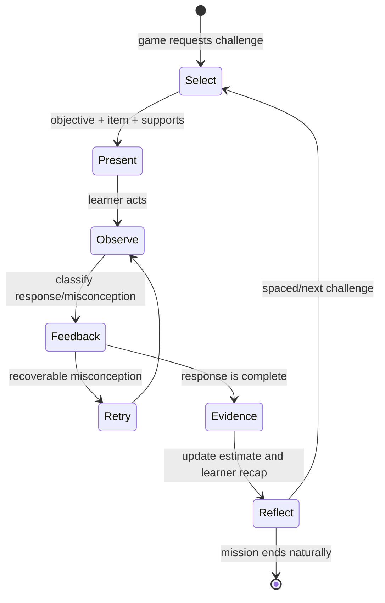

# Learning engine

## Responsibilities

The learning engine selects appropriate challenges, returns pedagogically specific feedback, records evidence, updates a cautious skill estimate and recommends the next objective. It does not control player movement, rendering, rewards or story state.

## Objective graph

An objective node contains jurisdiction links, prerequisites, common misconceptions, representations, task families and evidence thresholds. Crosswalks connect semantically similar nodes across nations without declaring them legally equivalent.

Example path: equal groups → multiplication facts → factor pairs → scaling → fraction-of-quantity. A learner can be at different confidence states on each node.

## Selection policy (v1)

1. Filter to teacher-approved curriculum scope and game-supported interaction types.
2. Exclude items recently seen or content with unmet hard prerequisites.
3. Prefer an approximate mix: 60% current growth zone, 25% spaced retrieval, 15% stretch/application.
4. Rotate representations and contexts to avoid memorising item appearance.
5. Apply accessibility needs without silently lowering the objective.
6. Return a human-readable reason (`Practising equivalent fractions because…`).

The prototype’s selector is intentionally simple; it prioritises low estimated mastery and avoids immediate item repetition.

## Evidence and mastery

Mastery is a decision supported by evidence, not a visible percentage pretending to be certainty. Store observations first and compute projections separately.

A skill can move to “secure” only after:

- multiple successful opportunities on separate occasions;
- at least two representations or task variants;
- at least one application/transfer item;
- limited support on the decisive evidence; and
- no recent consistent misconception signal.

Suggested child labels: `New`, `Growing`, `Secure`, `Ready to stretch`. Teachers see underlying evidence counts and content versions.

## Feedback ladder

1. Acknowledge effort neutrally; name what the learner did, not who they are.
2. Identify the successful concept or likely misconception.
3. Offer the least intrusive useful support: re-read → representation → partial worked example → complete model.
4. Retry with the same objective but a changed surface form.
5. After repeated difficulty, lower prerequisite complexity and notify the teacher view without labelling the child.

## Teacher controls

Teachers choose curriculum jurisdiction, year/level range, objectives, content exclusions, untimed mode, available representations and mission length. They can inspect why a recommendation was made, correct a mapping and export/delete learner evidence.

## Validation plan

- Curriculum review by qualified primary educators in each supported nation.
- Cognitive interviews with children across 7–10 and SEND/EAL groups.
- Item analysis for difficulty, distractor function and differential performance.
- Compare engine estimates with teacher judgements and independent transfer tasks.
- Monitor false confidence, repeated misconception and accessibility-support effects.

