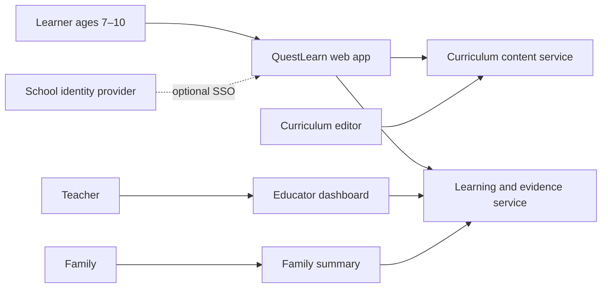
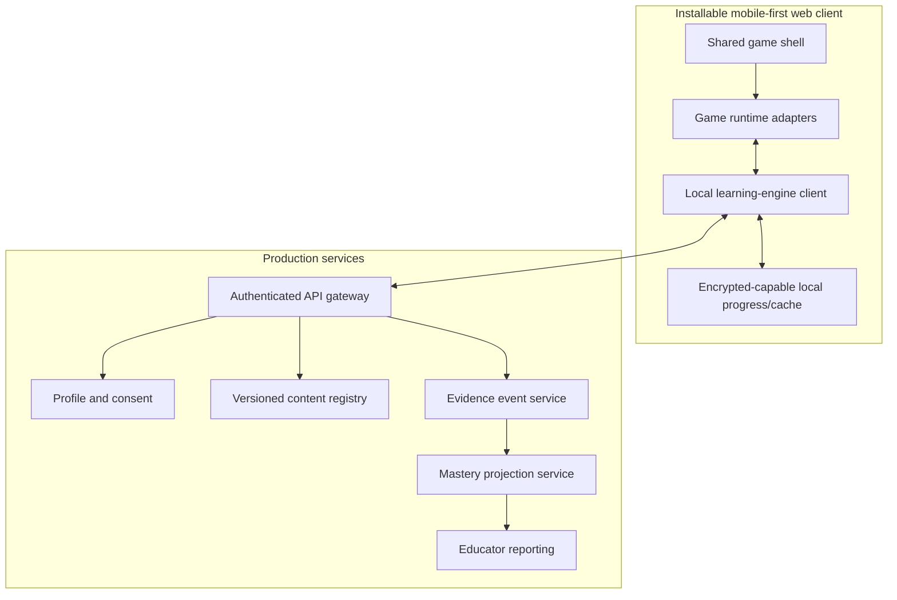

# QuestLearn platform architecture

## Goals

- Ship many game genres without duplicating curriculum, adaptation or reporting logic.
- Run well on low/mid-range phones, school laptops and tablets.
- Support guest/local play and school-managed accounts.
- Make learning claims auditable to objective, evidence and content version.
- Keep child data minimal, explainable and exportable/deletable.

## System context



## Container view



The repository prototype is deliberately static and local-first. Production services are an architectural target, not hidden inside the demo.

## Stable contracts

### `ChallengeRequest`

```json
{
  "schemaVersion": 1,
  "gameId": "blocksmith",
  "phase": "plan-wall",
  "learnerRef": "local:pseudonym",
  "eligibleObjectiveIds": ["ENG-M-Y3-MUL-01"],
  "interactionCapabilities": ["choice", "drag", "visual-model"],
  "maxSeconds": 45,
  "accessibility": { "untimed": true, "narration": false }
}
```

### `Challenge`

Includes immutable content version, jurisdiction references, objective and prerequisite IDs, prompt/response assets, accepted answer model, misconception-specific feedback, supports, evidence rubric, suitability metadata and safety review status.

### `EvidenceEvent`

```json
{
  "schemaVersion": 1,
  "eventId": "uuid",
  "occurredAt": "ISO-8601",
  "sessionId": "rotating-pseudonymous-id",
  "gameId": "blocksmith",
  "contentVersion": "2026.08.1",
  "objectiveId": "ENG-M-Y3-MUL-01",
  "interaction": "array-build",
  "outcome": "correct",
  "attemptCount": 1,
  "supportUsed": [],
  "responseTimeBand": "10-30s",
  "artifactRef": null
}
```

Do not put free-text child content, raw voice, precise timestamps unnecessary for learning, IP address or device fingerprint into learning events.

## Game adapter interface

Each game implements `mount`, `pause`, `resume`, `dispose`, `applyChallenge`, `applyFeedback`, `serializeSafeState` and an event channel. Browser runtime options:

- **2D:** Phaser is a suitable production candidate for platformer/narrative games. Prototype uses Canvas/DOM to keep the repo dependency-free.
- **3D:** Babylon.js or Three.js are suitable for the voxel/obby production runtime. Babylon.js is favoured when integrated physics, inspector and WebGPU/WebGL fallback reduce engineering overhead.
- **UI:** DOM overlay rather than canvas for prompts, focus, screen readers and responsive reflow.

Engine choice should be validated with a low-end Android performance spike before commitment.

## Deployment topology

- Static client and versioned game assets on CDN/object storage.
- Same-origin API gateway with strict CSP, no third-party advertising or analytics scripts.
- Regional application services; encrypted databases with tenant isolation.
- Append-only evidence ingestion plus derived mastery projections that can be rebuilt.
- Content publication through signed/versioned bundles with preview and rollback.
- Feature flags scoped to school/teacher, not opaque behavioural experimentation on children.

## Non-functional budgets

| Concern | Initial budget |
|---|---|
| Shell first meaningful view | < 2.5 s on representative low-end 4G device |
| Input latency | < 100 ms; movement target < 50 ms |
| Initial shell transfer | < 250 KB compressed before game asset pack |
| 2D frame rate | stable 60 fps target, 30 fps supported floor |
| 3D frame rate | stable 30 fps supported floor on target device |
| Offline | complete downloaded mission and queue minimal evidence |
| Accessibility | WCAG 2.2 AA surrounding UI; manual game-access review |
| Recovery | content rollback under 15 minutes; no mastery loss from projection rebuild |

## Observability

Operational telemetry (crashes, latency, asset failure) is separated from learning evidence. Use coarse device capability tiers, not fingerprints. Alerts cover error rates, content-unavailable responses, evidence queue lag, deletion failures and safeguarding report handling.

See [learning-engine.md](learning-engine.md), [game-engine.md](game-engine.md), [data-safety.md](data-safety.md) and [content-schema.md](content-schema.md).

