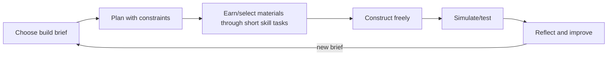

# Game plan 1: Blocksmith Worlds

## Promise

Build places that work because you understand the world. A child receives a meaningful brief—create a flood-safe river settlement, a pollinator garden or a Roman supply fort—and plans, measures, builds, tests and explains it.

## Core loop

## Modern game feel

First-person/third-person 3D voxel interaction, low input latency, strong placement preview, readable material effects, satisfying build sounds and instant undo. Cosmetic expression comes from mission discovery and design—not random paid rewards. Friends can co-build only in teacher-managed/local modes.

## Learning integration

- **Maths:** arrays, multiplication, perimeter/area/volume, fractions of plots, money/budget, coordinates, scale and data.
- **English:** spelling patterns, statutory words, homophones, prefixes, suffixes and punctuation assembled from mined letter stones.
- **Science:** plants, habitats, rocks/materials, states of matter, circuits, forces and fair tests.
- **Geography/history:** maps, settlements, rivers/biomes/resources and evidence-constrained historical builds.
- **Computing/D&T:** automation sequences, variables, sensors, structures and iterative evaluation.

Example brief: “Build a 24-plot habitat. Half must support flowering plants, one quarter water, and the rest shelter. The fence has a budget of 28 edge pieces.” The geometry is the actual build constraint, not a detached quiz.

## Mission structure

1. **Brief (1–2 min):** objective, context, success criteria and optional worked example.
2. **Plan (3–5 min):** sketch/ghost blocks; prediction recorded.
3. **Build (8–15 min):** material access via applied choices and construction.
4. **Test (2–4 min):** simulation reveals habitat/material/measurement consequences.
5. **Improve and explain (2–4 min):** child revises, then selects or records a structured justification.

## Failure and feedback

No destruction of hours of work. Failed simulation freezes, highlights observable effects and offers undo/retry. Feedback names the relevant concept. A hint may show a grid overlay or worked mini-model, recorded as support evidence.

## Playable prototype

The browser prototype is a free-roaming first-person 3D voxel world split into Numberland and English Land. The learner can mine the turf for moss, dig through multiple exposed layers, fall into excavated holes, chop voxel trees for wood, clear leaves and harvest glass crystals. Hidden stone blocks carrying letters or punctuation are distributed across the whole world at one, two and three blocks deep, with no surface indicator. Entering English Land shows one short, auto-dismissing discovery message explaining that digging reveals them. Natural changes and collected symbols persist on the device. Colour-coded resource piles still regrow so exploration or a mistake cannot permanently block progress. Placing a block spends that material or symbol; removing an unfinished block returns it.

The terrain is procedural but predefined: a fixed seed and value-noise height function produce the same uneven Minecraft-like hills on every fresh load. Terrain ranges across several block heights while all reserved fixtures and a one-tile ring around every quest remain level. The world layout uses one integer-column reservation map. River tiles, one-cell banks, quest pads, beacons, resource patches and signs, 45 trees, rocks, boundary hedges and the spawn area are allocated before 210 seeded flower attempts and buried letters are added. Decorations use their column's terrain height. Twelve original voxel farm animals—sheep, pigs, cows and chickens—roam deterministic loops around their own spawn areas. A validation test fails if two fixtures claim the same column. Quest beacons sit outside their pads, and only the active quest may place blocks on its reserved pad.

Thirty beacons form a visible Years 3–5 progression: 20 maths quests and 10 English quests. A learner reads a short question, collects the needed blocks, builds inside the active pad and asks the game to check the actual block positions, materials or symbols. The accepted quest gains a bright pulsing boundary and its beacon bobs more strongly so the build site is unmistakable. The child-facing brief and journal never render the internal answer plan. Feedback gives a recoverable next action without revealing derived counts or spelling before success. Correct builds remain as monuments and award a small bundle for free building. The complete progressions are documented in [`blocksmith-maths-quest-bank.md`](blocksmith-maths-quest-bank.md) and [`blocksmith-english-quest-bank.md`](blocksmith-english-quest-bank.md).

Every quest includes **Learn this** and **Show a hint** controls. Learn explains the transferable concept with different worked examples; Hint gives a smaller cue about the current task. Neither is forced open, and failed checks point back to support without automatically showing it.

After a quest is accepted, a persistent current-quest tile stays visible on mobile and desktop. It shows the quest number and live placed-block count; tapping it reopens the complete child-friendly brief without losing or restarting build progress.

| Level | Curriculum application | Physical evidence |
|---|---|---|
| Year 3, ages 7–8 | Equal sharing, simple fractions and multiplication arrays | Material groups, equal rows and equal-height towers |
| Year 4, ages 8–9 | Fractions, decimals, factor pairs, perimeter and area | Mixed-material builds, outlines, filled rectangles and fraction towers |
| Year 5, ages 9–10 | Percentages, fraction scaling and cuboid volume | Percentage material mixes, tall ratio towers and multi-layer cuboids |

This sequence follows the research in [`docs/research/england-years-3-5.md`](../research/england-years-3-5.md): Year 3 uses simple fractions and multiplication representations plus lower-Key-Stage-2 spelling and punctuation; Year 4 applies perimeter, fractions, homophones and word structure; and Year 5 applies volume, percentages and upper-Key-Stage-2 spelling patterns. It also follows the project feedback ladder: the game describes the observable mismatch and allows immediate revision instead of giving only correct/incorrect effects.

Desktop supports pointer-lock mouse look, WASD, gravity, jump, place/dig, numbered hotbar keys and optional flight with F, Space to rise and Shift to descend. Touch devices receive drag-to-look, movement, jump, place, dig and a dedicated flight toggle; double-tapping jump also toggles flight. On mobile, one drawer button pauses movement and opens all owned materials, letters and punctuation in a responsive grid, replacing the overlapping hotbar and letter strip. Players fall into mined holes and can jump or fly back out. A four-step device-aware welcome guide explains movement, looking, mining, placing, materials, beacons, jumping and flight, and can be reopened from the HUD. Material inventory and quest completion are stored locally. Prototype: [`site/games/blocksmith.html`](../../site/games/blocksmith.html).

## Production MVP boundary

Add full body collision, saved player constructions, science/design build validators, accessibility alternatives to first-person navigation, richer original textures/audio and teacher evidence export. The prototype uses Three.js from a pinned CDN module; production should bundle and integrity-audit the engine.

## Risks and tests

- **Creativity becomes constrained worksheet:** test whether briefs allow multiple valid designs.
- **Building overwhelms objective:** compare explanation/transfer after build vs quiz-only control.
- **3D controls exclude learners:** provide tap-to-place 2.5D fallback and test motor/access needs.
- **Incorrect simulation teaches misconception:** educator/science review and explicit model limitations.
