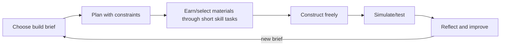

# Game plan 1: Blocksmith Worlds

## Promise

Build places that work because you understand the world. A child receives a meaningful brief—create a flood-safe river settlement, a pollinator garden or a Roman supply fort—and plans, measures, builds, tests and explains it.

## Core loop

## Modern game feel

First-person/third-person 3D voxel interaction, low input latency, strong placement preview, readable material effects, satisfying build sounds and instant undo. Cosmetic expression comes from mission discovery and design—not random paid rewards. Friends can co-build only in teacher-managed/local modes.

## Learning integration

- **Maths:** arrays, multiplication, perimeter/area/volume, fractions of plots, money/budget, coordinates, scale and data.
- **Science:** plants, habitats, rocks/materials, states of matter, circuits, forces and fair tests.
- **Geography/history:** maps, settlements, rivers/biomes/resources and evidence-constrained historical builds.
- **Computing/D&T:** automation sequences, variables, sensors, structures and iterative evaluation.

Example brief: “Build a 24-plot habitat. Half must support flowering plants, one quarter water, and the rest shelter. The fence has a budget of 28 edge pieces.” The geometry is the actual build constraint, not a detached quiz.

## Mission structure

1. **Brief (1–2 min):** objective, context, success criteria and optional worked example.
2. **Plan (3–5 min):** sketch/ghost blocks; prediction recorded.
3. **Build (8–15 min):** material access via applied choices and construction.
4. **Test (2–4 min):** simulation reveals habitat/material/measurement consequences.
5. **Improve and explain (2–4 min):** child revises, then selects or records a structured justification.

## Failure and feedback

No destruction of hours of work. Failed simulation freezes, highlights observable effects and offers undo/retry. Feedback names the relevant concept. A hint may show a grid overlay or worked mini-model, recorded as support evidence.

## MVP

One isometric/3D plot, 12 block types, three Year 3–4 missions, local save, maths/science packs, build validation, structured reflection and teacher evidence summary. Prototype: [`site/games/blocksmith.html`](../../site/games/blocksmith.html).

## Risks and tests

- **Creativity becomes constrained worksheet:** test whether briefs allow multiple valid designs.
- **Building overwhelms objective:** compare explanation/transfer after build vs quiz-only control.
- **3D controls exclude learners:** provide tap-to-place 2.5D fallback and test motor/access needs.
- **Incorrect simulation teaches misconception:** educator/science review and explicit model limitations.

