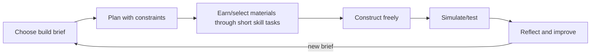

# Game plan 1: Blocksmith Worlds

## Promise

Build places that work because you understand the world. A child receives a meaningful brief—create a flood-safe river settlement, a pollinator garden or a Roman supply fort—and plans, measures, builds, tests and explains it.

## Core loop

## Modern game feel

First-person/third-person 3D voxel interaction, low input latency, strong placement preview, readable material effects, satisfying build sounds and instant undo. Cosmetic expression comes from mission discovery and design—not random paid rewards. Friends can co-build only in teacher-managed/local modes.

## Learning integration

- **Maths:** arrays, multiplication, perimeter/area/volume, fractions of plots, money/budget, coordinates, scale and data.
- **Science:** plants, habitats, rocks/materials, states of matter, circuits, forces and fair tests.
- **Geography/history:** maps, settlements, rivers/biomes/resources and evidence-constrained historical builds.
- **Computing/D&T:** automation sequences, variables, sensors, structures and iterative evaluation.

Example brief: “Build a 24-plot habitat. Half must support flowering plants, one quarter water, and the rest shelter. The fence has a budget of 28 edge pieces.” The geometry is the actual build constraint, not a detached quiz.

## Mission structure

1. **Brief (1–2 min):** objective, context, success criteria and optional worked example.
2. **Plan (3–5 min):** sketch/ghost blocks; prediction recorded.
3. **Build (8–15 min):** material access via applied choices and construction.
4. **Test (2–4 min):** simulation reveals habitat/material/measurement consequences.
5. **Improve and explain (2–4 min):** child revises, then selects or records a structured justification.

## Failure and feedback

No destruction of hours of work. Failed simulation freezes, highlights observable effects and offers undo/retry. Feedback names the relevant concept. A hint may show a grid overlay or worked mini-model, recorded as support evidence.

## Playable prototype

The browser prototype is a small free-roaming first-person 3D voxel world. The learner can mine the grass surface for moss, dig the exposed stone layer, chop voxel trees for wood, clear leaves and harvest glass crystals. Natural changes persist on the device. Colour-coded resource piles still regrow so exploration or a mistake cannot permanently block progress. Placing a block spends that material; removing an unfinished block returns it.

The world layout uses one integer-column reservation map. River tiles, one-cell banks, quest pads, beacons, resource patches and signs, trees, rocks, boundary hedges and the spawn area are allocated before decorative flowers are added. A validation test fails if two fixtures claim the same column. Quest beacons sit outside their pads, and only the active quest may place blocks on its reserved pad.

Six beacons form a visible Years 3–5 progression. A learner reads a short brief, collects the named materials, builds inside the glowing pad and asks the game to check the actual block positions and materials. Feedback gives a recoverable next action: change the count, swap a material or rearrange the shape. Correct builds remain as monuments and award a small bundle for free building.

| Level | Curriculum application | Physical evidence |
|---|---|---|
| Year 3, ages 7–8 | Half of 24; 3 × 4 array | 12 moss blocks; three rows of four wood blocks |
| Year 4, ages 8–9 | Perimeter; one quarter of a quantity | 5 × 3 stone outline; 9 wood and 3 glass |
| Year 5, ages 9–10 | Cuboid volume; 25% of a quantity | Filled 3 × 2 × 2 stone cuboid; 5 glass and 15 wood |

This sequence follows the research in [`docs/research/england-years-3-5.md`](../research/england-years-3-5.md): Year 3 uses simple fractions and multiplication representations, Year 4 applies perimeter and fractions, and Year 5 applies volume and percentages. It also follows the project feedback ladder: the game describes the observable mismatch and allows immediate revision instead of giving only correct/incorrect effects.

Desktop supports pointer-lock mouse look, WASD, jump, place/dig and numbered hotbar keys. Touch devices receive drag-to-look, movement, jump, place and dig controls. Material inventory and quest completion are stored locally. Prototype: [`site/games/blocksmith.html`](../../site/games/blocksmith.html).

## Production MVP boundary

Add collision/terrain physics, authored tutorials, saved player constructions, science/design build validators, accessibility alternatives to first-person navigation, richer original textures/audio and teacher evidence export. The prototype uses Three.js from a pinned CDN module; production should bundle and integrity-audit the engine.

## Risks and tests

- **Creativity becomes constrained worksheet:** test whether briefs allow multiple valid designs.
- **Building overwhelms objective:** compare explanation/transfer after build vs quiz-only control.
- **3D controls exclude learners:** provide tap-to-place 2.5D fallback and test motor/access needs.
- **Incorrect simulation teaches misconception:** educator/science review and explicit model limitations.
