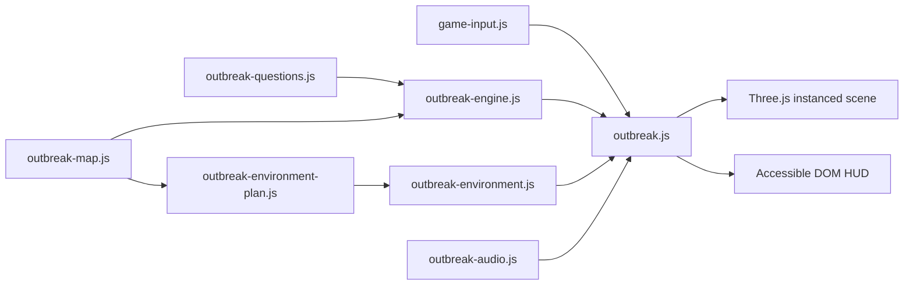

# Maths Outbreak

## Player promise

Solve a short maths equation, tag exactly that many blocky zombies, confirm the count and sprint to the newly opened checkpoint. Five checkpoint rounds make one complete operation. The action is energetic but child-safe: there is no blood, gore, public chat, advertising or paid random reward.

## Learning loop

1. Choose Year 3, 4 or 5.
2. Read the persistent equation and work out its answer.
3. Explore the arena, use cover and tag exactly the answer number of zombies.
4. Stop at the count you believe answers the equation.
5. Choose **Check answer** (or press **Enter** on a keyboard) to test the equation against the tagged count. An incorrect count restarts the current swarm with neutral feedback, without saying whether the count was high or low.
6. Reach the highlighted checkpoint to start the next equation and larger swarm.

The answer is never displayed in the prompt, tagged counter or Learn panel. Learn is generated for the current operation and explains a strategy with three worked steps. A death returns the learner to the most recent secured checkpoint and restarts only the current count.

The hitscan tests the complete block-zombie silhouette—head, torso, arms and legs. Every zone tags the same zombie once, headshots receive explicit feedback, and the nearest wall, crate or service-tunnel surface blocks a shot before any body part behind it.

## Year progression

| Year | Typical operations | Intended strategy |
|---|---|---|
| 3 | addition, subtraction, small multiplication, division | number bonds, partitioning, equal groups |
| 4 | larger mental addition/subtraction, multiplication, division, two-step expressions | place value, inverse checks, operation order |
| 5 | mental arithmetic, multiplication, unit fractions, 25%, ordered expressions | factor knowledge, fraction of a quantity, brackets first |

Targets stay between 3 and 15 so the mathematical answer produces a playable swarm. Sets are deterministic from the selected year and set number, while operands vary to provide repeatable, effectively unbounded operations.

## Gridlock Courtyard map

Gridlock Courtyard is an original 32 × 32 tile arena using a familiar competitive three-lane map archetype rather than copying a named commercial level. It has a west warehouse, central yard, east warehouse, outer lanes, cover crates and low service tunnels. All geometry snaps to the two-metre tile grid.

The arena is presented as **Gridlock Garden**, a bright daytime learning district rather than a grey industrial box. Its `gridlock-garden-keyart-v2` presentation translates the portal thumbnail into gameplay: high-saturation teal/orange paving, stepped school façades, a clock-and-flag Count Court tower, planted cover, flowers and floating glowing maths tiles. Number Works and Puzzle Depot retain distinct warm and cool façades, window rhythms, awnings, rooftop details and large readable signs. The first-person start faces this landmark composition.

The player carries a compact teal/yellow **number blaster** whose illuminated counter repeats the current tagged total. Zombies use larger toy-like bodies, varied green faces, colourful subject shirts, bright eyes, mouths and chest badges. The expressive facial meshes are presentation-only; the larger head, torso, arms and legs remain the four authoritative hitscan zones, so visual detail cannot create false shots.

Visual dressing is generated from `outbreak-environment-plan.js`, kept separate from the renderer-independent collision map. Street furniture is anchored only to already-solid cells, shrubs sit on existing cover and distant trees remain outside the playable boundary, so the richer scene cannot introduce invisible blockers. `outbreak-environment.js` renders the plan using shared materials and instanced geometry.

Six mapped pads define start plus five sequential checkpoints: South Safe Room, West Yard, West Warehouse, North Court, East Warehouse and Extraction Yard. A breadth-first path check proves each neighbouring checkpoint remains reachable. Walls block players, line of sight and zombie navigation. Crates provide cover; crouching close to one breaks pursuit. Service tunnels have low ceilings and require the player to duck.

## Controls

| Action | Desktop | Touch |
|---|---|---|
| Move | WASD | analogue stick |
| Look | mouse | drag the world |
| Tag | click or F | hold Fire |
| Run | Shift | hold Run |
| Duck/hide | C | Duck toggle |
| Check answer | Enter or the labelled Check answer button | Check answer button |
| Enter checkpoint | E or button | checkpoint button |

Checkpoint signs always spell **Checkpoint** in full rather than using the abbreviation “CP”. On desktop, the persistent action button includes a visible **Enter** keycap while counting zombies, then changes to an **E** keycap when the player is close enough to enter a checkpoint. The mission sentence repeats the same instruction and the welcome/help panels name both actions and keys. Touch layouts keep the plain-language button labels without irrelevant keyboard keycaps.

Pointer capture supports held touch controls, and the entire game disables text selection and touch callouts. The HUD is a responsive grid: brand, equation and essential counters occupy the top row; the mission sits beneath it; thumb controls stay in independent lower corners. On short landscape screens the controls shrink while the checkpoint or Check answer action remains centred and unobstructed.

Camera look follows conventional FPS orientation. Left/right input changes yaw around the upright world axis; up/down input changes pitch; roll always remains zero. Both mouse and touch use the same look resolver, which normalises repeated horizontal turns and clamps vertical look to about 83° before the view can invert. Strafing, damage markers and stereo warning sounds all derive their left/right axis from the same camera basis, so they remain visually correct after any horizontal turn.

Damage feedback remains visible even when the attacker is behind the camera. A red edge vignette flashes, a marker points towards the nearest attacker and a plain-language label says front, left, right or behind. The health panel pulses below 30 health. Procedural Web Audio adds a quiet arena drone, firing and hit sounds, alternating footsteps, stereo-panned nearby-zombie warnings, directional hurt cues and a low-health heartbeat; every cue respects the persistent mute control and needs no downloaded audio asset.

## Architecture

- `outbreak-questions.js`: deterministic Year 3–5 questions, Learn support and validation.
- `outbreak-map.js`: tile plan, collision, low clearance, line of sight and pathfinding.
- `outbreak-environment-plan.js`: deterministic visual zoning, landmark and decoration plan.
- `outbreak-environment.js`: shared-material, instanced Three.js environment renderer.
- `outbreak-engine.js`: renderer-independent run, counting, checkpoint, damage and swarm rules.
- `game-input.js`: reusable virtual stick and press-and-hold actions.
- `outbreak.js`: Three.js scene adapter, first-person camera, ray tagging and responsive HUD wiring.
- `outbreak-audio.js`: synthesised local ambience and cues with a persistent mute option.

## Performance budget

The floor, full walls, cover, tunnel ceilings, windows, roof trim, street furniture, planting, flowers and every repeated zombie body/face piece use instanced meshes. The four floating maths tiles and one clock-tower landmark are deliberately bounded hero geometry rather than unbounded decoration. The scene contains at most 24 pooled zombies, uses a fixed 60 Hz simulation with capped catch-up, and reports render calls and triangle count for profiling. Low-power mode activates for coarse pointers, ChromeOS, low core counts or low reported memory; it caps pixel density at 0.85, disables antialiasing and shadows, reduces flowers and halves the distant tree count. The checked-in desktop reference records the current renderer statistics rather than relying on an estimate.

## Acceptance evidence

- Unit tests cover 300 deterministic sets per year sweep, curriculum bounds, all tile routes, standing/crouching collision, answer-hidden exact-count confirmation, five-level completion, death recovery, deterministic swarm pooling, crouch hiding, the v2 key-art palette and safe deterministic environment placement.
- Visual references cover 390 × 844 touch portrait, 844 × 390 short landscape and 1280 × 720 desktop.
- The browser diagnostic must expose `data-outbreak-ready`, render calls and triangles with no `data-outbreak-error`.

Real-device acceptance should still include a Chromebook, Android tablet, iPad-class tablet, keyboard-only use and sustained frame-time profiling.
